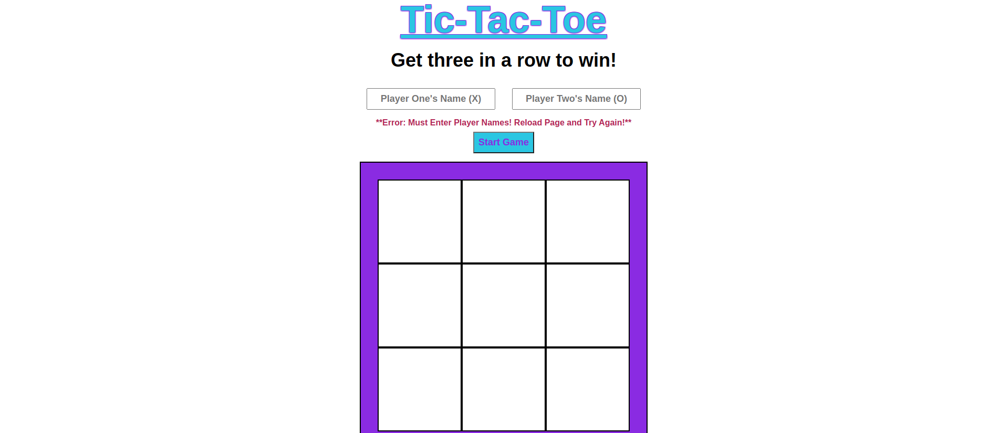
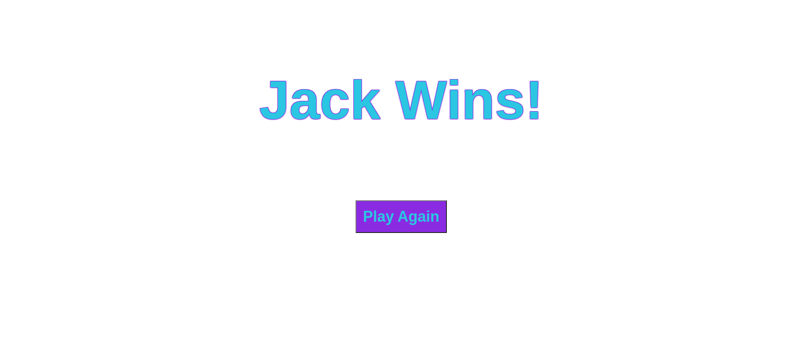

# Tic-Tac-Toe Game

**Objective**

I created a Tic-Tac-Toe game with JavaScript, HTML, and CSS. The game is meant to be played by two players.

***Game Images***

Game Start Screen:

Error Message:

Game Being Played:

Winner Message with "Play Again" Button:

Tie Message with "Play Again" Button:

***Features***

1. The game has a title and brief instructions in the header.
2. Each player enters their name in an input box before hitting the start game button. The name of the winner will be displayed in the winner message after the game, unless there is a tie.
3. The game cannot be played unless two names are entered. If players try to start the game without names they will see an error message pop up below the player name boxes.
4. Once player names are entered the "Start Game" button will be functional and it will enable the game board to be used once it is clicked.
5. The gameboard will alternate X's and O's on click till the game is won or a tie is called. Players will swap turns back and forth. Player One is always "X" and Player 2 is always "O".
6. The win or tie message will be displayed automatically when a player wins or all squares are used and a tie is called. This message is hidden and will replace the game start screen entirely when it is shown.
7. The "Play Again" button is also hidden and will show at the same time as the win or tie message. When it is clicked the game will reload and the players will be back at the fresh game screen.

